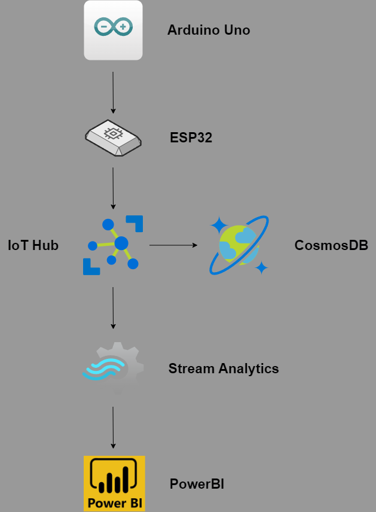
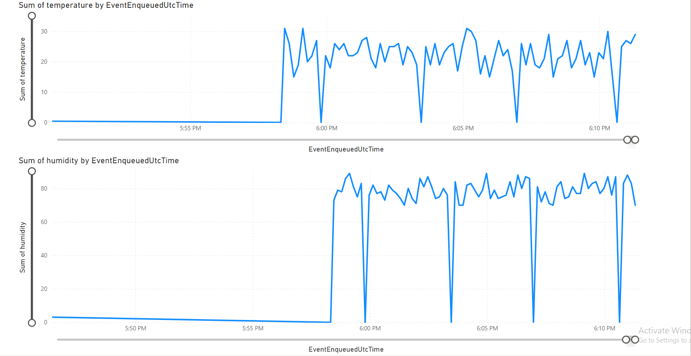

# IoT Project using Microsoft Azure, CosmosDB and PowerBI

## Project structure
This project contains code for an esp32 microcontroller that communicates with Microsoft Azure, this includes connecting the device to Azure, recieving Json data from an arduino and sending the data back to Azure. The main executable being Azure_IoT_Hub_ESP32.ino
 
**This code is located in:** Azure_IoT_Hub_ESP32
  
This project also contains code for an arduino uno microcontroller that sends Json data to the esp32 using UDP over a local network. But the code can be modified to run on only the esp32.
 
**This code is located in:** UPD_Comm\WiFiUdpSendString_Arduino
 
## Visualization

  

## Setup
1. **Following this tutorial set up your IoT hub and add a new device, in my case this is the esp32**
   - https://learn.microsoft.com/en-us/azure/iot-hub/iot-hub-create-through-portal
2. **Replace the variables in the iot_configs.h file**
   - In the WiFi section set the parameters to match your local network, the same can be done for the other configs.h file
   - In the Azure IoT section set IOT_CONFIG_IOTHUB_FQDN to the hostname of your IoT hub, which can be found under the overview section of your IoT hub
   - Set IOT_CONFIG_DEVICE_ID to be the same as your device in device managment / devices in the IoT hub, in my case the device name is "ESP32"
   - Next select the device and copy the primary key and paste it after IOT_CONFIG_DEVICE_KEY
3. **Upload the code to your esp32 and arduino, if you are only running an esp32 follow the comments on line 326 in the code instead**
   - After the code is uploaded you will see you local adress in the serial monitor
   - Put the adress of the esp32 in the arduino code and vice versa
4. **Next add a CosmosDB resource in Azure**
   - Go to the home page of Azure and create a new CosmosDB resource
   - Go to your IoT hub and add a new consumer group under Built-in endpoints
   - Then go under message routing and add a new route using this tutorial
   - https://techcommunity.microsoft.com/t5/internet-of-things-blog/set-up-an-azure-cosmos-db-custom-endpoint-directly-from-iot-hub/ba-p/3675886
5. **Connect Azure to PowerBI**
   - Create an account in PowerBI and follow this tutorial on how to cennect it with your data from Azure
   - https://learn.microsoft.com/en-us/azure/iot-hub/iot-hub-live-data-visualization-in-power-bi
## Safety
This setup has minimal safety as the only connecting factor towards the Azure hub is the private key of the device. This can be changed to accommodate x509 certfication and a SAS token. The other limiting factor regarding to safety is the UDP tranfer of data between the devices. Anyone connected to the same network with the right adress and port can send packets to the esp32, and the protocoll itself is unreliable as it does not provide a handshake that guarantees that the packet arrives. But for this project it is more than plenty, if we were to miss a packet once every hour it would not impact the data significally. 
## Result

